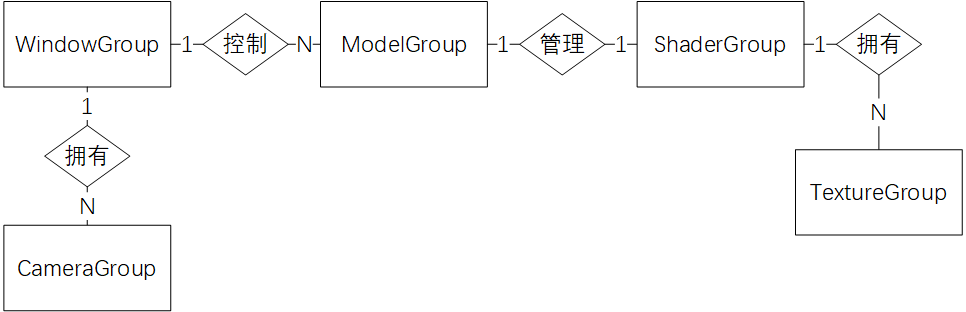

# Scene-Playground（暂时就叫这个名字，有好想法欢迎联系我）
-------
- 邮箱：616040809@qq.com  
- 作者：Mostro（目前）

这是我准备基于OpenGL 3.0+实现的一个物理引擎，原本打算只是写一个大作业，现在有了更加宏大的想法。

目前该项目还在实现当中，欢迎每个人（熟悉的不熟悉的）能给我意见，更希望有志之士能与我共同完成此项目。

## 此项目已经完成：
- 基本视角变化已经算法已经完成
- 对OpenGL接口进行了简单封装

## 项目目标：
- 原则上希望实现一个高性能的物理引擎，并用图形学建模、可视化（*但其实也不一定是物理引擎啦，还希望用它模拟更复杂的东西*）。
- 从科学计算的角度来看，实现星体的碰撞与破碎，星云的融合。
- 从图形学的角度，实现光照、镜面反射、粒子特效等。

## 实体关系图：

## 最近一次更新（黑体为要修改的地方）：
- 2018-4-20:
  - 使用Assimp导入3D模型。
  - ModelGroup中使用一个Shader和多个Mesh、Texture。
  - 部分地方微调。

- 2018-4-15：
  - 实现ModelGroup类。
  - 将着色器属性移入ModelGroup类。
  - 移除每个类的init函数，避免因为调用顺序不同产生错误的可能。
  - 简化了主程序步骤

- 2018-4-13：
  - 着色器、纹理类的实现。着色器可以直接导入纹理对象进行渲染。
  - 窗口对渲染列表进行渲染。
  - 所有对象都在渲染列表中被渲染。
  - 添加ReadMe。
  - 上传了一个使用Assimp读取Obj文件的例子。
  - **着色器应该全局唯一，并且是模型的属性**
  - **着色器不能是窗口的属性**
  - **任何图形应该拥有单独的类**
  - **着色器在窗口中进行无差别渲染（不进行额外操作，和普通Group对象相同）**
  - **下一步读取Obj文件，并显示，不考虑光照**
